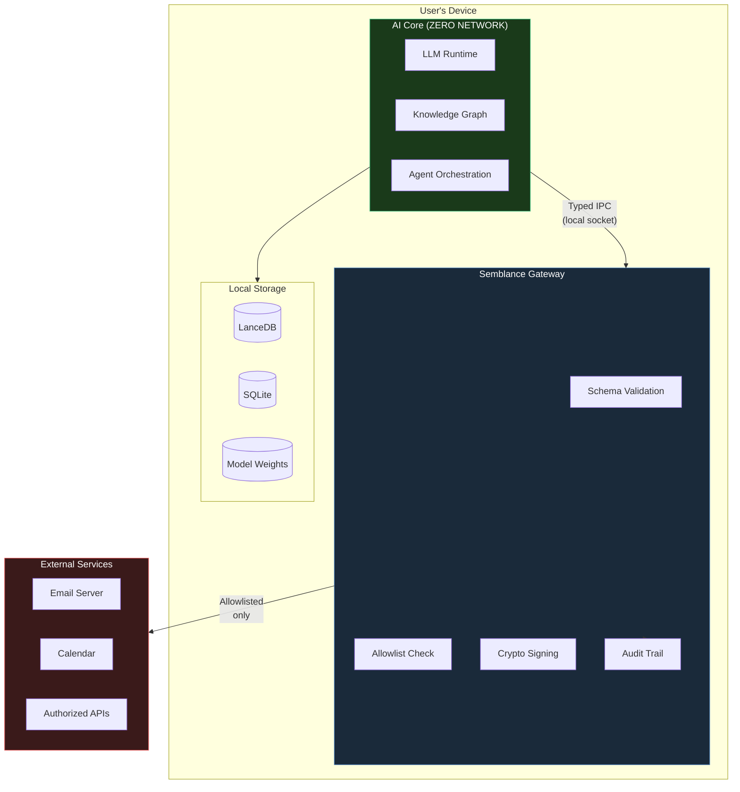

# Semblance Privacy Architecture

**Privacy is the architecture. Not a feature. Not a toggle. Not a promise.**

This document describes how Semblance protects your data at every layer — and how you can verify every claim yourself.

---

## The 5 Inviolable Rules

### Rule 1: Zero Network in AI Core

The AI Core — the process that reasons about your life — has zero network capability. This is enforced at three levels:

1. **Import-level:** An automated scanner (`scripts/privacy-audit/index.js`) checks every import in `packages/core/` for networking libraries. Banned imports include: `fetch`, `XMLHttpRequest`, `WebSocket`, `http`, `https`, `net`, `axios`, `got`, `node-fetch`, `undici`, `ws`, and all Rust networking crates (`reqwest`, `hyper`, `tokio::net`, `std::net`).

2. **Build-level:** The privacy audit runs on every commit in CI. A failure blocks the merge. No networking code can enter the AI Core without breaking the build.

3. **OS-level:** Tauri's sandbox entitlements restrict the AI Core process from making outbound connections. Even if a networking library were somehow imported, the OS would block the connection.

**Approved exceptions (exactly two):**
- `node:net` in `packages/core/agent/ipc-client.ts` — for Unix domain socket / named pipe IPC (local only, not internet)
- `ollama` npm package in `packages/core/llm/` — runtime check refuses non-localhost URLs

### Rule 2: Gateway Only

All external network calls flow through the Semblance Gateway (`packages/gateway/`). The Gateway is the sole process with network entitlement. It accepts only:

- Typed, schema-validated action requests from the AI Core via local IPC
- Requests matching a user-authorized service on the allowlist
- Requests passing rate limiting and anomaly detection

The Gateway **rejects**: arbitrary URLs, domains not on your allowlist, requests failing schema validation, and anything triggering anomaly detection.

### Rule 3: Action Signing and Audit Trail

Every action passing through the Gateway is:

1. Cryptographically signed with request ID, timestamp, action type, and payload hash (HMAC-SHA256)
2. Logged to the append-only audit trail (SQLite WAL) **before** execution
3. Verified after execution with the response recorded
4. Tagged with estimated time saved

The audit trail is tamper-evident: each entry includes a chain hash linking it to the previous entry. Modifying any entry breaks the chain.

### Rule 4: No Telemetry

Zero analytics. Zero crash reporting. Zero usage tracking. Zero third-party SDKs that phone home. This applies to every component: AI Core, Gateway, desktop app, mobile app, component library, tests, scripts, and build tools.

Not opt-in. Not opt-out. Not "anonymous." Not "aggregated." The architecture makes telemetry impossible.

**Banned packages** (enforced in CI):
Segment, Mixpanel, Amplitude, PostHog, Sentry, Bugsnag, Datadog, Google Analytics, and any dependency that makes network calls during initialization.

### Rule 5: Local Only Data

All user data is stored exclusively on the user's device:

| Data Type | Storage | Location |
|-----------|---------|----------|
| Knowledge graph | LanceDB | `~/.semblance/data/` |
| Embeddings | LanceDB | `~/.semblance/data/` |
| Structured data | SQLite | `~/.semblance/data/` |
| Action history | SQLite (append-only) | `~/.semblance/audit/` |
| Preferences | SQLite | `~/.semblance/config/` |
| Model weights | File system | `~/.semblance/models/` |

No cloud sync. No cloud backup. No remote storage. If the device is off, the data is inaccessible.

---

## Data Flow



**Key points:**
- The AI Core has no arrow to External Services — it cannot reach them
- All external communication passes through validation, allowlisting, signing, and audit logging
- Storage is entirely within the device boundary

---

## What Semblance Stores

### Knowledge Graph (LanceDB)

Semblance builds a local knowledge graph from your data sources:

- **Entities:** People, organizations, projects, topics extracted from your emails, calendar, files
- **Relationships:** Who works with whom, what project relates to what topic
- **Events:** Meetings, deadlines, transactions, communications
- **Embeddings:** 768-dimensional vector representations for semantic search (all-MiniLM-L6-v2 or nomic-embed-text)

All vectors are computed locally. No embedding API calls. No data leaves the device for embedding.

### Structured Data (SQLite)

- Action audit trail (append-only, tamper-evident)
- User preferences and configuration
- Autonomy tier settings per domain
- Service allowlist and credentials (encrypted at rest)
- Subscription and recurring charge detection data
- Time-saved tracking per action type

### Model Weights

- LLM weights (Ollama-managed, typically 2-8GB per model)
- Embedding model weights (~90MB for MiniLM)
- All downloaded through the Gateway from user-configured sources

---

## What Semblance Never Does

- **Never uploads your data** — The AI Core cannot access the network
- **Never profiles you** — There is no analytics infrastructure to profile with
- **Never sells data** — There is no mechanism to extract data from the device
- **Never trains on your data** — All inference is local; your data never reaches a training pipeline
- **Never phones home** — No heartbeat, no update check, no license validation requiring network
- **Never shares with third parties** — The Gateway only contacts services YOU explicitly authorized
- **Never stores data off-device** — No cloud sync, no cloud backup, no remote cache

---

## Verification

### Automated (CI — runs on every commit)

```bash
# Full privacy audit: scans all imports in packages/core/ for network capability
node scripts/privacy-audit/index.js
```

This script:
1. Walks every `.ts`, `.tsx`, `.js` file in `packages/core/`
2. Extracts all import statements
3. Checks each against the banned networking library list
4. Fails with a non-zero exit code if any violation is found
5. Reports the exact file, line, and import that violated

### Manual Verification

```bash
# Verify: AI Core has no network imports
grep -rn "import.*fetch\|import.*http\|import.*axios\|import.*ws\b" packages/core/

# Verify: No telemetry packages anywhere
grep -rn "segment\|mixpanel\|amplitude\|posthog\|sentry\|bugsnag" package.json packages/*/package.json

# Verify: No @semblance/dr in core (boundary enforcement)
grep -rn "@semblance/dr" packages/core/

# Verify: Audit trail integrity (in-app)
# The Network Monitor shows all outbound connections in real time
# The Action Log shows every action with cryptographic chain verification
```

### Third-Party Audit

The entire open source codebase (`packages/core/`, `packages/gateway/`, `scripts/privacy-audit/`) is available for independent security audit. We welcome and encourage external review.

---

## Third-Party Dependencies

Semblance maintains a strict dependency policy:

**Pre-approved (no network capability):**
- `ollama` — JS client for local Ollama (runtime-enforced localhost only)
- `lancedb` — Embedded vector database (no network)
- `better-sqlite3` — SQLite binding (no network)
- `zod` — Schema validation (pure logic)
- `nanoid` — ID generation (pure logic)
- `date-fns` — Date handling (pure logic)

**Banned categories:**
- Analytics SDKs (Segment, Mixpanel, Amplitude, PostHog)
- Error tracking that phones home (Sentry, Bugsnag, Datadog)
- Any dependency making network calls during initialization
- Electron (we use Tauri for smaller attack surface)

All dependencies are reviewed for network capability before approval. The CI pipeline scans for banned packages on every commit.

---

## Proof of Privacy

Semblance's privacy guarantees are not claims — they are verifiable properties of the code:

1. **The AI Core cannot access the network** — Verified by automated import scanning, enforced by OS sandbox
2. **All actions are logged before execution** — Verified by integration tests, enforced by Gateway protocol
3. **The audit trail is tamper-evident** — Verified by chain hash integrity checks
4. **No telemetry exists** — Verified by dependency scanning, enforced by CI
5. **All data is local** — Verified by the absence of cloud storage imports or configuration

Every one of these properties can be confirmed by reading the source code. That's why it's open source.

---

## Responsible Disclosure

If you discover a privacy or security vulnerability in Semblance, please report it to **security@semblance.run**. Do not open a public issue. We will acknowledge receipt within 48 hours and provide a fix timeline within 7 days.

---

*Copyright (c) 2026 Veridian Synthetics. This document is part of the Semblance open source project, licensed under MIT and Apache 2.0.*
